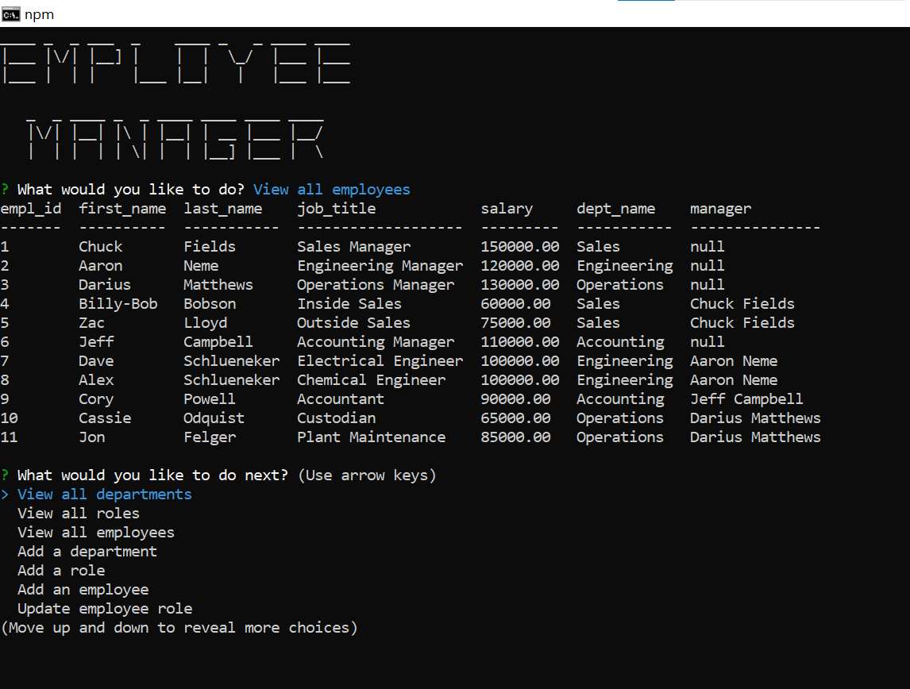

  # employee-crud
  * 

  ## Description
  The application is an employee management system.  It is used to help keep track of employees, roles, and departments.  It keeps multiple pieces of data, including employee names, job titles, salaries, departments, and managers.  This is done utilizing node and MySQL database.

  ## Table of Contents
  * [Walkthrough](#walkthrough)
  * [Installation](#installation)
  * [Usage](#usage)
  * [Result-Screenshot](#result-screenshot)
  * [Contributing](#contributing)
  * [Tests](#tests)
  * [Questions](#questions)
  * [License](#license)

  
  ## Walkthrough
  * [Walkthrough video](https://drive.google.com/file/d/1rfNoDHJLg0LlfDr9uf5m2ifSisXL4vrx/view)
  
  ## Installation
  *  Install Node.js
  *  Install MySQL
  *  Clone repo and navigate to the directory in the terminal
  *  In terminal type 'npm init' to initialize the application
  *  Install [npm inquirer](https://www.npmjs.com/package/inquirer), [npm console.table](https://www.npmjs.com/package/console.table), [npm mysql2](https://www.npmjs.com/package/mysql2), [npm dotenv](https://www.npmjs.com/package/dotenv), [npm figlet](https://www.npmjs.com/package/figlet)
  *  Create a .env file to hold your MySQL credentials
  *  In mysql terminal from directory login and source the schema.sql and seeds.sql.  Now you are ready to roll!
  
  
  ## Usage
  Once install steps have been followed open your terminal and navigate to the directory the repo is located in.  Once there type 'npm start' to initiate the application. From there simply follow the prompts to utilize the application.
  
  
  ## Result-Screenshot
  
  
  
  
  ## Contributing
  Clone the repo and make any changes you would like.  Then reach out via contact info in Questions section to share your improvements.
  
  
  ## Tests
  Use it
  
  
  ## Questions
  GitHub: [J2021T](https://github.com/J2021T)

  EMAIL: [jordan.turcott@gmail.com](mailto:jordan.turcott@gmail.com)
  
  
  ## License
  This project is covered under the [MIT](../assets/license-files/MIT.txt) license.

 
  
  
